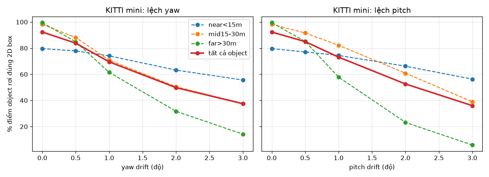
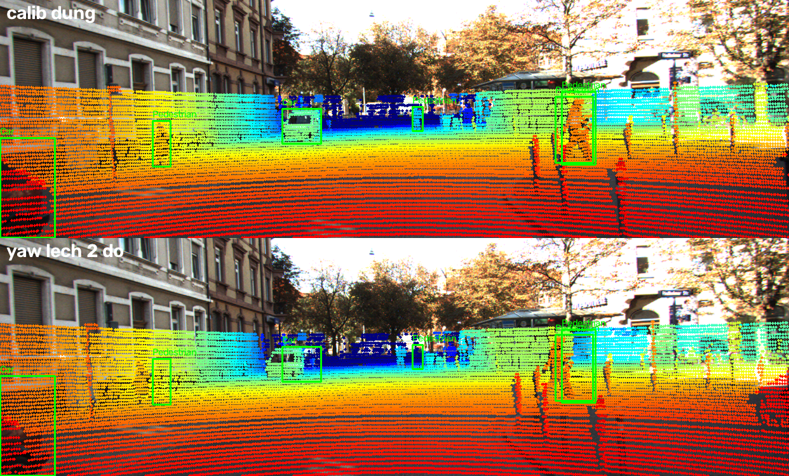
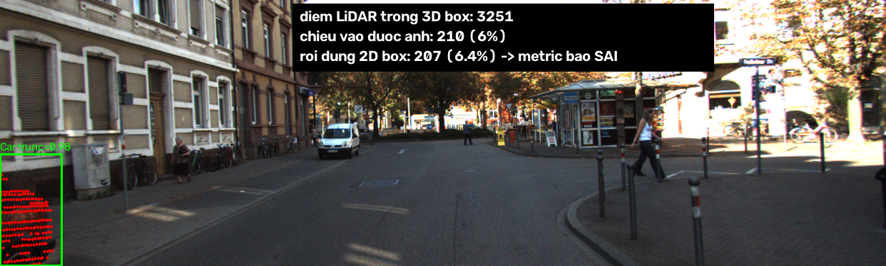

# Báo cáo Day 6: Độ nhạy của LiDAR-camera projection với calibration drift

- **Họ tên:** Phạm Văn Hoàng Anh Tú
- **MSSV:** 2A202602507
- **Lớp:** Track 4
- **Link repo:** https://github.com/tubepvhat1604-bot/day06-2A202602507
- **Topic:** A — LiDAR-camera projection QA
- **Dataset:** data/kitti_mini (20 frame), data/nuscenes_mini_subset (20 frame), data/synthetic (demo)
- **Các frame đã dùng:** toàn bộ 20 frame của kitti_mini (demo và failure: 000011); 20 frame đầu của nuscenes_mini_subset (demo: scene-0103_010)

## 1. Claim

Trên KITTI, khi LiDAR bị lệch **yaw 1°**, tỉ lệ điểm LiDAR của object rơi đúng vào 2D box GT giảm từ **92.3% xuống 69.5%**. Vật ở xa bị ảnh hưởng mạnh nhất: với vật **trên 30 m**, tỉ lệ này giảm từ **99.5% xuống 61.5%**. Ngược lại, lệch tịnh tiến 10 cm gần như không đổi kết quả (90.4%). Như vậy, lệch góc nguy hiểm hơn lệch vị trí nhiều, và nên kiểm tra drift bằng các vật ở xa.

## 2. Evidence

Cách đo: lấy các điểm LiDAR nằm trong 3D box GT (tính bằng calib đúng), rồi chiếu chúng lên ảnh bằng calib đã bị làm lệch, sau đó đếm % điểm rơi vào 2D box GT. Mỗi lần chỉ thay đổi 1 yếu tố. Dữ liệu gồm 98 object (Car/Pedestrian/Cyclist/Van, mỗi object có ≥ 20 điểm) trên 20 frame. Thí nghiệm không có yếu tố ngẫu nhiên, nên chạy lại luôn ra cùng số.

Số liệu đầy đủ ở `results/calib_drift_kitti_mini.csv` (theo từng object: `results/calib_drift_kitti_mini_per_object.csv`).

| Mức perturb | % điểm trong box (tất cả) | Gần < 15 m | 15–30 m | Xa > 30 m | % điểm trong FOV |
|---|---|---|---|---|---|
| none | 92.3 | 79.6 | 98.2 | 99.5 | 15.7 |
| yaw 0.5° | 83.8 | 77.9 | 88.1 | 84.8 | 15.7 |
| yaw 1° | 69.5 | 74.1 | 70.8 | 61.5 | 15.8 |
| yaw 2° | 49.8 | 63.2 | 50.5 | 31.7 | 15.8 |
| yaw 3° | 37.5 | 55.6 | 37.6 | 14.2 | 15.8 |
| pitch 1° | 73.1 | 74.4 | 82.2 | 57.8 | 15.0 |
| pitch 3° | 36.0 | 56.3 | 39.0 | 5.9 | 13.5 |
| ty 2 / 5 / 10 cm | 92.1 / 91.7 / 90.4 | 79.5 / 79.2 / 78.3 | 98.0 / 97.3 / 95.4 | 99.3 / 99.2 / 98.5 | 15.7 |





Nhận xét:
- **% điểm trong FOV gần như không đổi** (15.7 → 15.8%) khi lệch yaw. Đây là một metric **không dùng được** để phát hiện drift, phải đo theo từng object.
- Lệch góc θ làm điểm ở khoảng cách d bị dời khoảng d·tan θ. Ở 40 m, lệch 1° tương đương khoảng 0.7 m, bằng cả bề ngang một người đi bộ. Ngược lại, dịch 10 cm thì ở mọi khoảng cách vẫn chỉ lệch 10 cm.

**So sánh 2 dataset (`results/calib_drift_nuscenes_mini_subset.csv`):** trên nuScenes, yaw 1° chỉ giảm từ 80.7% xuống 80.0%, và **pitch gần như không ảnh hưởng**. Có 3 lý do: (1) hệ trục LiDAR của nuScenes là x sang phải, y hướng tới trước, nên phép "pitch quanh trục y" của `perturb_extrinsic` thực chất là **roll** quanh hướng nhìn, ít làm điểm dời khỏi box; (2) trong 20 frame không có object nào xa hơn 30 m, mà vật gần thì ít nhạy với lệch góc; (3) LiDAR 32 beam cho ít điểm trên mỗi object, và mức baseline đã thấp sẵn (80.7%) vì ảnh có độ phân giải cao hơn và có độ lệch thời gian giữa LiDAR và camera.

### Bonus

**B1: So sánh 2 cấu hình metric** (`results/bonus_b1_metric_v1_vs_v2.csv`). Cả 2 cấu hình chạy trên cùng 20 frame KITTI với cùng các mức lệch yaw:
- **v1** = % tất cả điểm của object rơi vào 2D box (metric gốc).
- **v2** = chỉ xét object có truncated < 0.5, và chỉ tính trên các điểm đã chiếu vào được ảnh. Đây là cách sửa lỗi ở failure case mục 3.

| yaw | v1 trung bình % | v1: % object < 85% | v2 trung bình % | v2: % object < 85% |
|---|---|---|---|---|
| 0° (calib đúng) | 92.3 | 12.2 | 99.1 | **2.2** |
| 0.5° | 83.8 | 32.7 | 89.7 | 24.7 |
| 1° | 69.5 | 55.1 | 74.2 | 48.3 |
| 3° | 37.5 | 83.7 | 40.5 | 78.7 |

Ưu nhược điểm: v2 giảm tỉ lệ báo động giả khi calib đúng từ **12.2% xuống 2.2%**, và mức baseline gần 100% nên đặt ngưỡng dễ hơn. Đổi lại, v2 bỏ qua 9/98 object (các xe sát mép ảnh), nên có ít mẫu hơn. v1 dùng được mọi object nhưng nhiễu hơn với vật ở gần.

**B3: Latency projection** (`results/bonus_b3_latency.csv`): đo `project_velo_to_image` trên frame 000011 (108k điểm), bỏ 5 lần chạy đầu, đo 50 lần, chạy trên CPU (thông tin phần cứng ghi trong CSV): **p50 = 6.3 ms, p95 = 7.45 ms**. Như vậy dư sức chạy online ở tốc độ 10 Hz của LiDAR.

**B4: Tool dùng lại được:** `python -m src.calib_drift_sweep --help` (có các tham số `--data-root`, `--max-frames`, `--min-pts`, `--out-dir`).

**B5: Hai dataset:** xem đoạn so sánh KITTI và nuScenes ở trên.

## 3. Failure case



**Khi nào sai:** frame 000011 có một chiếc Car ở khoảng cách 4.1 m bị cắt ở mép trái ảnh (truncated = 0.98). Dù **calib hoàn toàn đúng**, metric chỉ cho **6.4%** điểm nằm trong box: trong 3251 điểm LiDAR của xe, chỉ 210 điểm chiếu vào được khung ảnh. Đây cũng là lý do nhóm "gần < 15 m" có baseline thấp (79.6%), trong khi nhóm xa đạt 99.5%.

**Vì sao sai, thuộc lớp nào:** lỗi nằm ở lớp **Metric**, không phải Geometry. Phần lớn thân xe nằm ngoài FOV của camera, nhưng 2D box GT đã bị cắt theo mép ảnh, nên các điểm nằm ngoài ảnh bị tính là "rơi sai box". Nếu dùng metric này để cảnh báo drift khi chạy thật, hệ thống sẽ **báo động giả** mỗi khi có xe đi sát bên cạnh.

**Cách khắc phục / phát hiện:** (1) chỉ tính % trên các điểm đã chiếu vào được trong ảnh; (2) bỏ qua object có truncated > 0.5 hoặc có 2D box chạm mép ảnh; (3) chỉ dùng object ở khoảng cách 15–40 m để đo drift, vì đó là nhóm nhạy với lệch góc nhất và ít bị cắt.

## 4. Khuyến nghị nếu triển khai thật

**Use-case:** xe ADAS có LiDAR và camera fusion. Sau va chạm nhẹ hoặc rung lắc lâu ngày, giá gắn sensor có thể lệch 0.5–1°.
- **Có phát hiện được không:** lệch 1° làm vật > 30 m mất khoảng 38 điểm phần trăm điểm trong box, nên phát hiện được nếu theo dõi metric theo **từng nhóm khoảng cách**. Lệch 0.5° chỉ giảm khoảng 8–15 điểm, cần lấy trung bình qua nhiều frame mới thấy được.
- **Trade-off:** tính metric này cần detector 2D trên ảnh và rất rẻ (vài ms mỗi frame trên CPU), nhưng phụ thuộc vào chất lượng detector. Kiểm tra online liên tục thì phát hiện sớm hơn nhưng dễ báo động giả. Nên đặt ngưỡng trên trung bình trượt khoảng 100 frame.
- **Cần ghi log:** in-box % theo từng nhóm khoảng cách, số object hợp lệ mỗi frame, % điểm trong FOV, độ lệch timestamp giữa LiDAR và camera. Cảnh báo khi in-box % của nhóm 15–40 m xuống dưới khoảng 85%.
- **Bước tiếp theo:** thay GT box bằng box của detector 2D, và thêm edge-alignment score (Canny) để không phụ thuộc vào label.

## 5. Cách chạy lại

```bash
pip install -r requirements.txt
python -m starter.projection --data-root data/synthetic --frame 000000
python -m starter.projection --data-root data/kitti_mini --frame 000011
python -m starter.projection --data-root data/nuscenes_mini_subset --frame scene-0103_010
python -m src.calib_drift_sweep --data-root data/kitti_mini
python -m src.calib_drift_sweep --data-root data/nuscenes_mini_subset --max-frames 20
python -m src.make_figures
python -m src.bonus
python tools/check_submission.py
```

Script có tham số dòng lệnh, xem bằng `python -m src.calib_drift_sweep --help`.

## 6. Khai báo sử dụng AI

| Công cụ | Dùng cho việc gì | Bạn đã kiểm chứng thế nào |
|---|---|---|
| Claude | Gợi ý code 2 hàm TODO (`velo_to_cam`, `cam_to_image`), script `src/calib_drift_sweep.py` và `src/make_figures.py`, `src/bonus.py`, viết nháp REPORT | Test điểm velodyne (10, 0, 0) cho z_cam ≈ 9.7; xem overlay trên 3 dataset thấy điểm khớp với vật thể và không có điểm trên trời; tự chạy lại sweep ra đúng số trong bảng; đọc và hiểu từng hàm |
